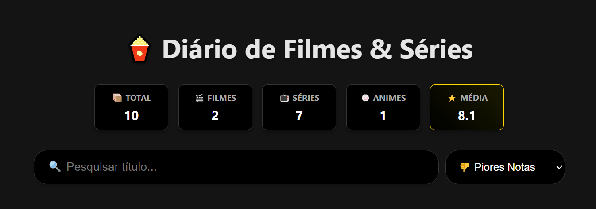

# 🍿 Diário de Filmes & Séries

Um Web App completo para organizar e avaliar filmes, séries e animes assistidos. O projeto funciona como um **PWA (Progressive Web App)**, podendo ser instalado no celular como um aplicativo nativo.

   

## 🌐 Demonstração Online
Acesse o projeto rodando em tempo real:
👉 **[https://meus-filmes-series.vercel.app](https://meus-filmes-series.vercel.app)**

---

## 🛠️ Tecnologias Utilizadas

* **Front-end:** HTML5, CSS3 (Grid & Flexbox), JavaScript (ES6+).
* **Back-end (BaaS):** Firebase Firestore (NoSQL Database).
* **Mobile:** PWA (Manifest.json & Service configs).
* **Hospedagem:** Vercel.
* **Versionamento:** Git & GitHub.

## ✨ Funcionalidades Principais

### 📱 Experiência do Usuário (UX/UI)
* **Design Responsivo:** Layout estilo "Netflix" (Grid) que se adapta perfeitamente ao celular e PC.
* **Dark Mode:** Interface moderna e confortável para leitura.
* **Skeleton Loading:** Animação de carregamento ("pulsação") enquanto os dados são buscados.
* **Toasts Notifications:** Avisos visuais elegantes (Sucesso/Erro) ao realizar ações.

### ⚙️ Funcionalidades Técnicas
* **CRUD Completo:** Criar, Ler, Atualizar e Deletar itens do catálogo.
* **Dashboard (BI):** Painel no topo com estatísticas em tempo real (Total, Contagem por Tipo e Média de Notas).
* **Filtros Inteligentes:** Ordenação por Melhores Notas, Piores Notas, Mais Recentes e Antigos.
* **Busca Instantânea:** Filtra os filmes na tela enquanto você digita.
* **Compartilhamento:** Botão direto para recomendar o filme via **WhatsApp**.

### 🔐 Segurança & Admin
* **Modo Visitante:** Por padrão, o site é "Somente Leitura". Visitantes não veem botões de editar/excluir.
* **Modo Admin:** Acesso restrito via URL (